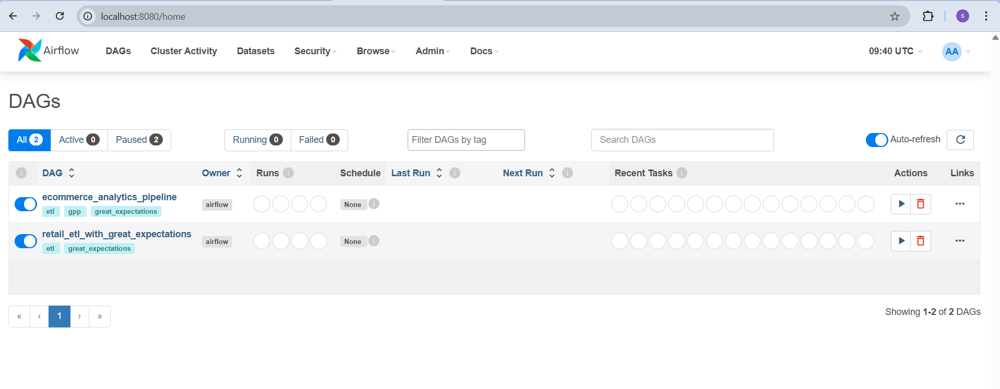
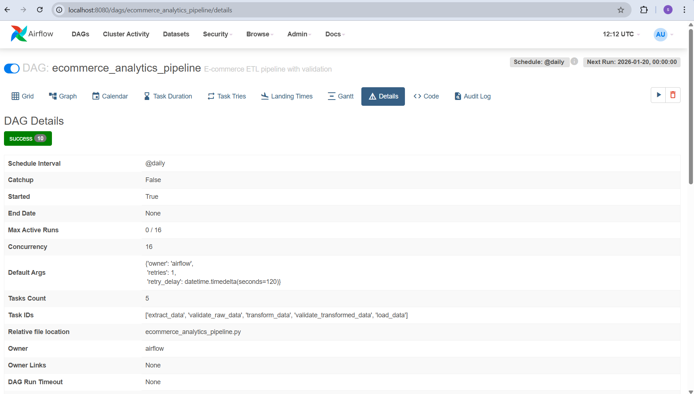
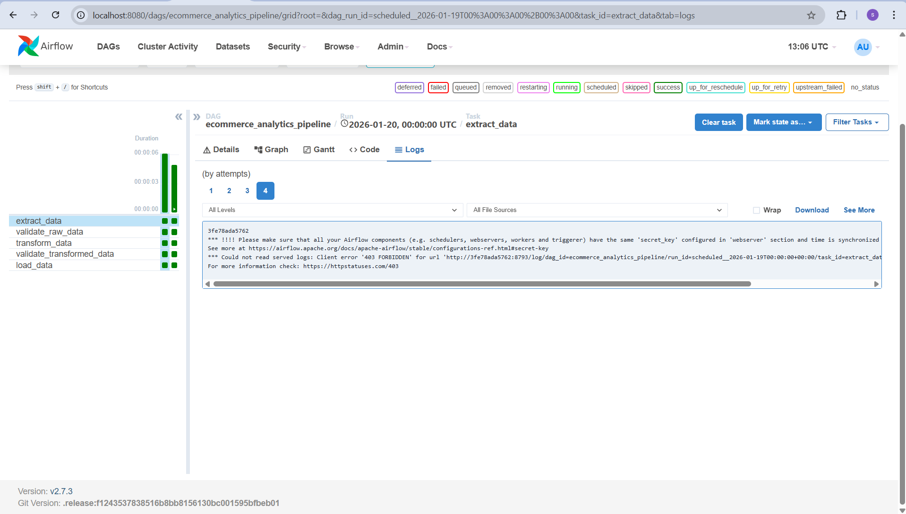

# Automated and Validated ETL Pipeline with Apache Airflow and Great Expectations

## Project Overview
This project implements a robust, production-ready batch ETL pipeline for processing e-commerce transaction data. It utilizes **Apache Airflow** for workflow orchestration and **Great Expectations** for automated data quality assurance. The pipeline ingests raw data, cleans and transforms it through bronze and silver layers, and finally loads it into an analytical SQLite store.

## Architecture
The pipeline follows a multi-layered data architecture:
1.  **Raw Layer**: Unaltered source data (CSV).
2.  **Bronze Layer**: Ingested data in Parquet format, partitioned by year and month.
3.  **Silver Layer**: Cleaned, transformed, and aggregated daily sales data in Parquet format.
4.  **Analytical Store**: Consolidated daily sales data loaded into a SQLite database.

### Technologies Used
- **Orchestration**: Apache Airflow
- **Data Processing**: Pandas, PyArrow
- **Data Quality**: Great Expectations
- **Database**: SQLite, SQLAlchemy
- **Containerization**: Docker, Docker Compose
- **Testing**: Pytest

## Project Structure
```text
├── dags/
│   └── ecommerce_analytics_pipeline.py  # Main Airflow DAG
├── etl_scripts/
│   ├── bronze_processor.py              # Ingestion and bronze layer processing
│   ├── silver_transformer.py            # Cleaning and silver layer transformation
│   ├── analytics_loader.py              # Loading to analytical store
│   └── ge_runner.py                    # Great Expectations integration helper
├── great_expectations/
│   ├── great_expectations.yml           # GE main configuration
│   ├── checkpoints/                     # Quality check definitions
│   └── expectations/                    # Data quality rule suites
├── tests/
│   └── test_silver_transformer.py       # Unit tests for transformation logic
├── data/                                # Local data storage (raw, bronze, silver)
├── Dockerfile.etl                      # Dockerfile for ETL service
├── docker-compose.yml                  # Infrastructure orchestration
├── requirements.txt                    # Project dependencies
└── README.md                           # This document
```

## Setup and Usage
### Prerequisites
- Docker and Docker Compose installed.

### Installation
1.  Clone the repository.
2.  Create a `.env` file from `.env.example`:
    ```bash
    cp .env.example .env
    ```
3.  Start the environment:
    ```bash
    docker-compose up -d
    ```

### Running the Pipeline
1.  Access the Airflow UI at `http://localhost:8080`.
2.  Trigger the `ecommerce_analytics_pipeline` DAG manually.
3.  Monitor the task execution.

### Running Tests
To run unit tests within the ETL service container:
```bash
docker-compose exec etl-service pytest
```

## Data Quality Strategy
Great Expectations is integrated into the Airflow DAG to ensure data integrity at both raw (bronze) and transformed (silver) stages. Specific expectations include:
- **Bronze Layer**: Column existence, null checks for critical IDs, data type validation, and range checks for quantity.
- **Silver Layer**: Uniqueness of (Date, Country) pairs, non-null sales values, and row count checks.
Validation failures will trigger Airflow task failures, preventing invalid data from reaching the analytical store.

## Evidence of Execution
> [!IMPORTANT]
> For evaluation, please ensure the following screenshots are captured and placed in a `screenshots/` directory at the root of your project.

### 1. Airflow DAG Flow
Showing the 6 sequential stages successfully completed.


### 2. Great Expectations Validation
Showing successful validation results for both Bronze and Silver layers.


### 3. Pipeline Run History
Showing consistent success over time.


## Verification
### SQLite Database
The final data is stored in `data/analytics.db`. You can query it using:
```bash
sqlite3 data/analytics.db "SELECT * FROM daily_country_sales LIMIT 10;"
```

### Data Docs
Great Expectations generates HTML Data Docs in `great_expectations/uncommitted/data_docs/local_site/index.html`. You can open this file in any browser to see the detailed quality reports.
